# 使用Alternates分支

Alternates（有时也指版本或者分支）允许你创建**一个单独 mockup 设计的副本**，而不需要在你的工程中添加新的 mockups。  
在探索理念的设计初级阶段和在靠后一点添加评论家的反馈和建议的阶段，创建 alternates 是很有用的方式。  
使用 alternates 的一些理由：  

- 你想要每一个屏只创建一个 mockups，然而每一个却有很多想法。
- 你想得到设计的改进意见，但却不想被人更改 mockups。
- 你想将你的项目发出去获得反馈意见，而且每一个反馈意见你想单独处理。
- 你想尝试新的设计理念，但并不希望它包含在现有的 mockups 上。

这里是一个综述:

<!-- 一个视频，加载不出来 -->

##  创建 Alternates

当你浏览 mockup 没有选中任何一个控件时，你将在 mockup 注释的下面看到一部分 [Property Inspector 面板](http://support.balsamiq.com/customer/portal/articles/110114)，名为 **"Alternate Versions"**。  

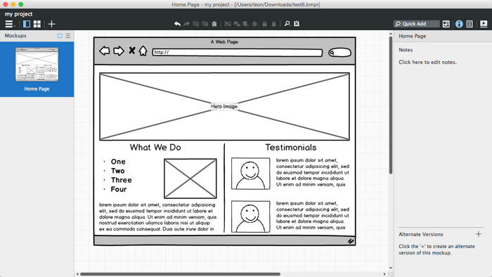  

**点击 "+" 图标**位于 "Alternate Versions" 旁边来创建一个新的 alternate。  

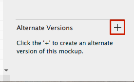 

或者使用 [Navigator panel](http://support.balsamiq.com/customer/portal/articles/109151#filebrowser) 中的上下文菜单。  

  

这将会创建**一个当前 mockup 的拷贝作为 alternate 版本**供你修改。但是默认的它将被自动命名为 "Alternate" 加一些随机数和字母来确保名字是唯一的。  

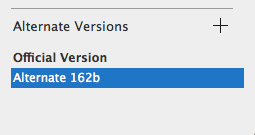

**alternate 版本的下拉列表中会提示你当前你所工作在 mockup 的哪一个版本**。你可以创建任何个 alternates。  

>注释：你可以为一个 alternate 创建 alternate。当一个 alternate 被选中是点击 "+" 图标会创建一个选中版本的 alternate 而非正式版本。  

如果你正在使用的 alternate 版本同时也在 [Navigator panel](http://support.balsamiq.com/customer/portal/articles/109151#filebrowser) 是正式版本，那么将有 mockup 名插入在 alternate 名之后。

在 alternate 版本列表的名字上双击或者右键选择 "Rename..."可以进行**重命名**  

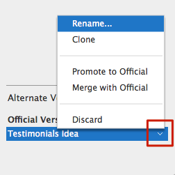  

## 编辑 Alternates

在你创建 alternate 版本之后你可以像对其它 mockup 一样对它进行编辑，包括添加资源和标记。你的修改**不会影响主干分支的 mockup** (作为 Official Version 显示的)。你也可以在注释面板添加注释来描述你的想法或者用来与其它人来交流它。  

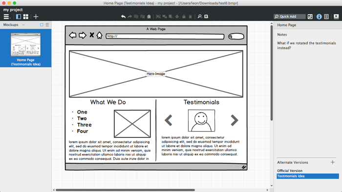

从属性面板里的列表或者在 Navigator panel 中的上下文菜单中选择版本的名字来从一个 mockup 的所有 alternate 版本中选择一个版本。你也可以选择回到 Official Version 通过在列表上选择它。  

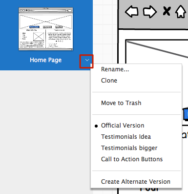

>注释：如果你[连接](http://support.balsamiq.com/customer/portal/articles/111742)到包含有 alternate 的 mockup 时，这个链接将会转到在 alternates 表中选中的 mockup 版本。  

## 升级 Alternates   

如果相比于原始的 mockup，你更喜欢另一种 alternate 的话，你可以将其“升级”到官方版本，这将会代替并重写原始版本。  

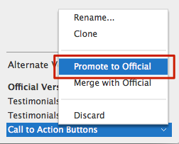

>注释：通过撤销指令 (CTRL/CMD+Z)，你有三次撤销该命令的机会。  

已升级的 alternate 会被保留，以防你想要将其保存至变化历史记录中。否则的话，你可以将其[删除](http://support.balsamiq.com/customer/portal/articles/1956540-working-with-alternates#discarding)掉。  

## 合并 Alternates   

如果你想合并官方版本的 alternate 的某些组件的话，你可以使用合并选项。  

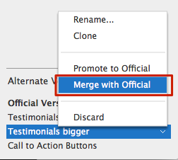  

如下图所示，选择 "Merge with Official" 就可以将选中版本中的内容添加到官方版本中 mockup 内容的右边。  

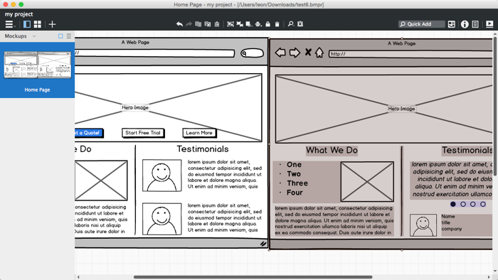  

如果 alternate 中的注释和原始版中的注释不一样，那么他们同样会通过一条虚的水平线被合并或者分离。  

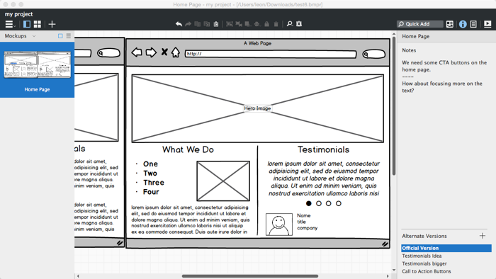  

之后，你就可以手动地编辑内容，来创建一个新的官方版本了，这个版本是各个版本里你喜欢的元素的融合。  

  

## 删除 Alternates   

在完成检查或者将各个 alternate 版本整合到官方版本的工作后，你就可以通过 "Discard" 选项来删除你再也不会使用的 alternates 了。  

## 设计 Alternates   

有些情况下，你可能**需要在几个 mockups 中提出一系列的 alternates 的设计来**。这种情况可能会发生在当你在看其他人的 mockups，并且想让他们看看你在整个设计中提出的设计改变的时候。  

当你想要重命名一个 alternate 的时候，你可以在重命名对话框的一个选项列表中选择，列表中是已有的 alternate 的名称。这使得在几个 mockups 中使用相同的 alternate名称变得方便。  

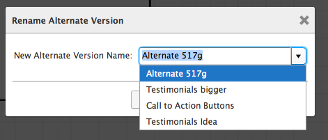  

在紧挨着 Mockups 的 Navigator 选项板中，有一个菜单显示了**你的设计中出现的所有 alternates 的名字**。  

在这个列表中选择一个 alternate，将会**选择出所有 mockups 中有相同名称的 alternate**。  

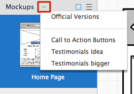  

>注释：这在概念上相当于在代码库中创建一个分支，除了它只适用于有特定的 alternate 版本名的 mockups。  

因此，例如，如果你创建了一系列叫 "Leon's Proposal" 的 alternates 并且适用上面显示的菜单栏来选中那个名字，那么任何包含有名为 "Leon's Proposal" 的 alternate 的 mockup 都会显示出那个 alrenate 版本。  

没有同名 alternate 的 Mockups 是不能被更新的。改进、合并和丢弃操作暂时不允许在多个 mockups 之间跨越。  

  

 

