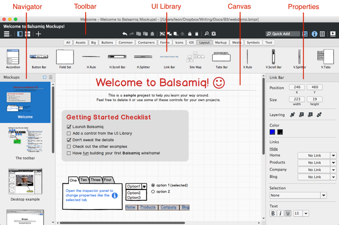
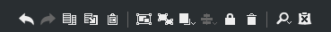
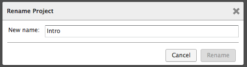
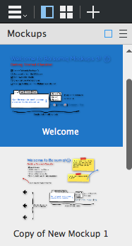
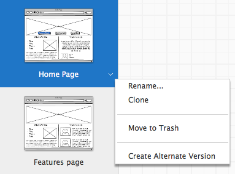
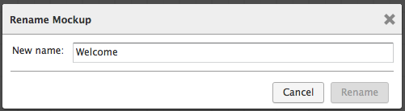
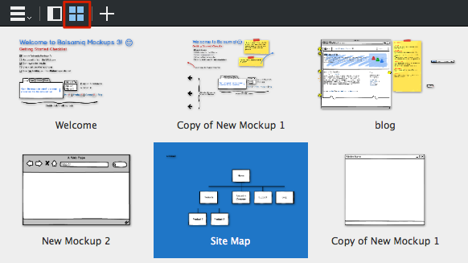

# Mockups 应用概述

**最新更新！**  
这个页面已经被更新为[Balsamiq Mockups 3](https://balsamiq.com/products/mockups/)。旧文档在[这里](http://media.balsamiq.com/files/Balsamiq_Mockups_v1-v2_Docs.pdf)。

Balsamiq Mockups 是一个创建[线框](http://support.balsamiq.com/customer/portal/articles/880427)（也被叫做实物模型或者低保真原型）的用户接口设计工具。你可以使用它来形成你产品思路的数字草图，在代码编写之前协助讨论和理解。 

每个 Balsamiq Mockups 文件（有一个 .bmpr 文件扩展名）代表一个项目并包含许多实物模型和图片，它们被一起存储在一个单独的 .bmpr 文件中。不同项目的实物模型应该在各自的 Balsamiq Mockups 文件中被创建。为了创建一个新的项目，可以从菜单中选择 Project > New Project。

**注意：**单独的项目文件在 Balsamiq Mockups 3 中都是是新的。（[了解更多](http://support.balsamiq.com/customer/portal/articles/1844131#projects)）

Balsamiq Mockups 用户接口由五个基本的区域组成：[工具栏](http://support.balsamiq.com/customer/portal/articles/109151#appbar)，[UI 库](http://support.balsamiq.com/customer/portal/articles/109151#uilibrary)，[画布](http://support.balsamiq.com/customer/portal/articles/109151#canvas)，[导航面板](http://support.balsamiq.com/customer/portal/articles/109151#filebrowser)和[属性面板](http://support.balsamiq.com/customer/portal/articles/109151#propertiespanel)。每个都会在下面被描述。

在 UI 区域上的 myBalsamiq 独有的文档，查看 [myBalsamiq 编辑文档](http://support.balsamiq.com/customer/portal/articles/1366973)。

**注意：**你可以在我们的 [Mockups Intro Video tutorial](http://support.balsamiq.com/customer/portal/articles/107966) 看一个包含基本应用程序使用方法的视频。

## 工具栏

工具栏包含一系列的图标用来在其他用户接口的区域执行操作。

第一个图标集如下所描述。

1.在 Mockups,[资产](http://support.balsamiq.com/customer/portal/articles/110401)，[标志](http://support.balsamiq.com/customer/portal/articles/110439)和[垃圾箱](http://support.balsamiq.com/customer/portal/articles/1844131#trash)间导航  
2.展示/隐藏左边的面板  
3.用一个缩略图显示你的实物模型  
4.创建一个新的实物模型  
5.Mockup 动作（重命名等）和在实物模型间（当左边面板被隐藏时展示）导航  
6.到下一个或前一个实物模型（当左边面板被隐藏时展示）

工具栏中心的图标组作用于通常执行的[画布](http://support.balsamiq.com/customer/portal/articles/109151#canvas)功能。这些是你可能在文章编辑器或者其他绘画工具中已经习惯的动作，比如复制，粘贴，分组，排列和缩放。最后一个图标是用来切换标记的（[阅读有关标记的细节](http://support.balsamiq.com/customer/portal/articles/110418)）。

工具栏最右边的最后一部分包含了[快速添加工具](http://support.balsamiq.com/customer/portal/articles/109151#quickadd)，[UI 库](http://support.balsamiq.com/customer/portal/articles/109151#uilibrary)，[属性检视视图](http://support.balsamiq.com/customer/portal/articles/110114)和[项目信息面板](http://support.balsamiq.com/customer/portal/articles/1895403)的切换图标，和一个进入[全屏展示模式](http://support.balsamiq.com/customer/portal/articles/111756)的图标。

工具栏的顶部展示了项目的名字，你可以双击来重命名（或者到菜单中的 Project > Rename Project...）。

## 快速添加工具

快速添加工具是最快的添加 UI 控件到你的实物模型的方法。为了使用快速添加，在快速添加输入框内点击（或者使用 / 或者 + 键盘快捷键来进入）。从一个 UI 控件或者图标输入一些字母，快速添加将为你显示一列推荐。使用你的鼠标或者方向键来快速浏览列表然后点击或者按下 Enter 来给实物模型画布添加控件或图标。你也可以使用 Shift + Enter 来将控件放到你的鼠标游标在画布上的位置。

例如，输入 “bu” 显示了一些包含 “Button”，“Button Bar”，“Help Button”，“Radio Button” 和 “Round Button” 的列表。另一方面，输入 “hel”，仅仅返回 “Help Button”。按下 ESCape 键使得列表消失，就像我们所期待的那样。

现在尝试下快速添加吧！当你熟悉它，你甚至可以隐藏 UI 库并简单地使用快速添加来添加 UI 元素到你的实物模型中。这最大化了你的画布区域和速度！

## UI 库

UI 库，或者 UI 控件，是工具栏下的 UI 控件的长条地带。它罗列了所有 Mockup 和[资产](http://support.balsamiq.com/customer/portal/articles/110401)，[图标](http://support.balsamiq.com/customer/portal/articles/110202)和[标志](http://support.balsamiq.com/customer/portal/articles/110439)的 UI 控件的类型。UI 库的主要目标是让你添加 UI 控件到实物模型画布，但是你也能使用它来为你的实物模型获得灵感。

为了添加一个新的 UI 控件到画布，选择你想要添加的控件类型，然后可以拖动它到下面的实物模型画布，或是简单地双击它，Balsamiq Mockups 将为你把它放到实物模型画布中。

UI 库能通过几种方式被打开或关闭：点击快速添加框右边的图标，使用键盘快捷键 CTRL/CMD + L，或者通过选择应用程序菜单栏的 View > UI Library。

## Mockup 画布

这是 Balsamiq Mockups 的主要工作区域，在那里你的 UI 实物模型被赋予生命。一旦你添加了 UI 控件，你能移动它们，调整它们到你的核心内容，直到你的 UI 实物模型已经准备完毕。看[使用 UI 控件](http://support.balsamiq.com/customer/portal/articles/110078)以了解更多。

实物模型画布根据你的应用程序窗口增加或收缩，所以如果需要的话你可以为更大的实物模型分配空间。

**注意：**如果你在一个小屏幕上工作或者有很大的实物模型，你可能想要读[这篇关于隐藏面板来为画布获得更多空间的文章](http://support.balsamiq.com/customer/portal/articles/2038151)

## 导航面板

位于左边的导航面板展示了实物模型，资产或者你项目中的标志。当前选择的对象被突出了。实物模型和资产能以文本列表或者缩略图预览的形式被查看。

你可以通过点击面板上方导航切换图标来隐藏导航面板（键盘快捷键：CTRL/CMD + J）。隐藏它将显示工具栏中额外的图标（[如上所示](http://support.balsamiq.com/customer/portal/articles/109151#appbar)），来在实物模型或者资产（依赖于被选择的那一个）间导航。

可以通过从画布中分离导航面板并把它向左或向右拖动，放置你的鼠标游标到线上来调整面板大小。你可以双击分隔线来把它重新设置为默认宽度。

实物模型能在导航面板中通过把它们向上或向下拖动被重新排序。这在[导出到 PDF](http://support.balsamiq.com/customer/portal/articles/111730#exportpdf) 时是有用的。举个例子。当你关闭并重新打开你的项目，甚至在一台不同的电脑上打开时，你的实物模型的顺序将被记住。

### 上下文菜单动作

一个在导航面板上打开的上下文菜单对于项目来说也是可以获得的。你可以通过右击选择的项目或是点击当你在它身边移动时出现的小箭头来打开菜单。

这个菜单的内容根据哪种类型的对象被选择而显得不同（实物模型，资产，标志或垃圾），但是它通常包含比如重命名，移动到垃圾箱或者克隆的选项。在 Mockups 视图中，它也包含使用 [alternates](http://support.balsamiq.com/customer/portal/articles/1956540) 的动作。

### 重命名 Mockups

重命名实物模型可以通过上下文菜单或者通过双击导航面板中的实物模型的名字来完成。有[链接](http://support.balsamiq.com/customer/portal/articles/111742)的实物模型在当所连接的实物模型名字被改变时将自动更新。

## 属性面板

应用程序（当显示时）右边的面板展示了所选择的控件或者对象的属性。依赖于所选择的图标，它展示了或是[属性检视视图](http://support.balsamiq.com/customer/portal/articles/110114)或是[项目信息面板](http://support.balsamiq.com/customer/portal/articles/1895403)。它能通过选择视图菜单中的工具栏或未检查的检视视图的图标以及项目信息中的图标来隐藏。

## 缩略图

点击图标右边的[导航面板](http://support.balsamiq.com/customer/portal/articles/109151#filebrowser)切换将转换到缩略图，以下是展示。

这个视图展示了所有你的实物模型的缩略图，这对于获得你项目的整体预览是有用的。它允许你立刻看见更多的有关实物模型，而且是一个非常好的用来重排序和整理（例如，重命名和移动到垃圾箱）的视图。

缩略图在查看实物模型和资产时可获得，而且是仅有的垃圾箱可获得的视图。
