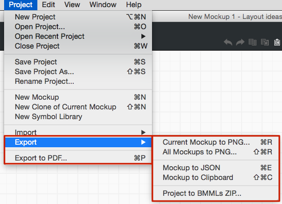
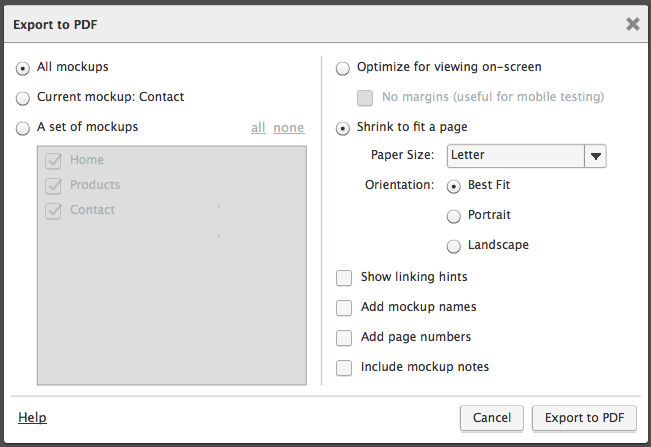
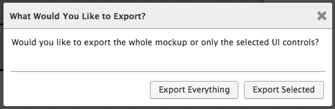

# 导出Mockups

**最近已经上传完毕！** 
   
这篇网页是为了 [Balsamiq Mockups 3](https://balsamiq.com/products/mockups/) 而上传的。原来的文件您可以点击[这里](http://media.balsamiq.com/files/Balsamiq_Mockups_v1-v2_Docs.pdf)来观看。

导出菜单包括以下导出选项：

请继续阅读对每一条的描述。

## 以 PDF 形式导出

你可以将 mockups 以 PDF 的形式导出到你的项目中，你可以用来打印或是发送邮件，或呈现给用户，或是在互联网上发送。如果你的 mockups 包含链接，同样可以用 PDF 的形式进行导出，并且允许你自行设计创建一个单击原型。（*要了解更多有关链接的信息，请查看*[*Linking Mockups Together*](http://support.balsamiq.com/customer/portal/articles/111742)。）

**注意**：当导出 PDF 至 **myBalsamiq** 时，请查看 myBalsamiq 文档中的 [Managing Projects](http://support.balsamiq.com/customer/portal/articles/112399#managingproject)。

导出 PDF 时，选择项 Project > Export to PDF...菜单命令（快捷键：CTRL/CMD + P ）。每一个 mockup 将会在 PDF 中独立的一页中显示。mockup 将会和项目中的顺序保持一致，所以在导出前请安排还他们的顺序。

PDF 导出选项显示如下：

导出之后，将会出现一个通知窗口询问你将 PDF 保存到哪里。点击按钮打开包含的文件夹。

## 以图片形式导出

如果你想要把你的项目或是 mockups 以图片的形式导出，则在导出菜单那种选择导出 PNG 命令。Export > Mockup to PNG...将把你选中的 mockup 以 PNG 的格式进行保存，当选择 Export > Project to PNGs...时，你的项目中所有的 mockups 将保存为多个独立的图片文件。

将你的 mockups 或者是项目以图片的形式导出的快捷键分别为 CTRL/CMD + R 和 CTRL/CMD + Shift + R。

你同样可以将你 mockups 中的某一些选中控件导出在画布上，并使用导出 PNG 命令。导出对话框将询问你是否想要导出你选中的组件或是整个 mockup。

## 打印

Balsamiq Mockups 不再支持直接使用打印机打印服务。但是你可以导出为 PDF 并通过 PDF 查看软件进行打印。

## 将 mockups 导出至另一个项目

使用项目菜单中的 导入/导出 Mockup JSON 命令你可以快速的从一个项目中拷贝 mockups 至另一个项目。导出至 Mockups JSON(Project > Export > Mockup to JSON) 命令将拷贝选中的 mockup 的 Balsamiq Mockups 代码至剪贴板。要将这个 mockup 创建在一个新的项目中，就要切换至这个项目，并且在 Project > Import 菜单中选择 “Import Mockup JSON…” 并且粘贴复制好的代码。

## 使用先前版本的导出

你同样可以导出你先前 Balsamiq Mockups 的版本或是不支持 [new BMPR file format](http://support.balsamiq.com/customer/portal/articles/1844131#projects) 的项目。

选择 Export > Project to BMMLs ZIP...命令会将你的 mockups 保存为 ZIP 文件，并且在资产子文件夹中包含 BMML 文件（支持 Balsamiq Mockups 版本 2）和图片以及符号。你可以上传这些文件到 myBalsamiq 或者将它解压并且使用老版本的 Balsamiq Mockups 打开 mockups。

**注意**：这也是导出使用 Confluence 或 JIRA  Balsamiq Mockups 的 mockups 的方法。[这里为更多细节指导](http://support.balsamiq.com/customer/portal/articles/721932)

## 从其他 Balsamiq 产品导出

如果你正在寻找我们的插件的导出指导，包括 Google Drive, Confluence 和 JIRA，[请查看 FAQ 页面](http://support.balsamiq.com/customer/portal/articles/721932)

想要从 myBalsamiq 导出，请看[这篇文章](http://support.balsamiq.com/customer/portal/articles/235574)
