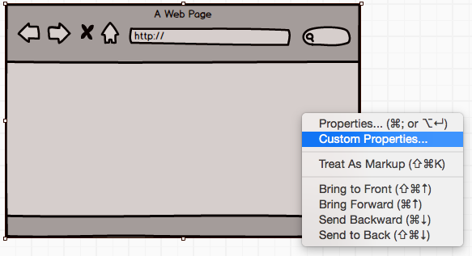
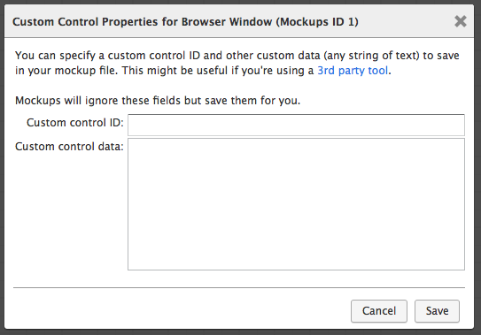

# 什么是自定义属性？

**最近已经上传完毕！** 
   
这篇网页是为了 [Balsamiq Mockups 3](https://balsamiq.com/products/mockups/) 而上传的。原来的文件您可以点击[这里](http://media.balsamiq.com/files/Balsamiq_Mockups_v1-v2_Docs.pdf)来观看。  

如果您想要使用[可以扩展 Mockups 的第三方工具](http://support.balsamiq.com/customer/portal/articles/135659)的其中一种，或者您想要为开发者增添额外细节，又或者您想要做其它任何事情的话，这个特征都是可用的。

您可以在您的模型上右键单击任何控制键并且在右键菜单上选择 "Custom Properties..."。

这会打开一个如下的对话框。

在这个对话框中您可以为已经选择好的控制键添加自定义 ID 和与它对应的自定义数据。Balsamiq Mockups 不会使用这些属性，但是这些属性会随着剩余的模型被保存在工程中。

其它工具可以使用这些数据来做一些高级的东西，比如当控制键被点击或者只是单纯地使用您在导出代码中指定的自定义 ID 时，允许您指定的一些 JavaScript 语句来运行。
