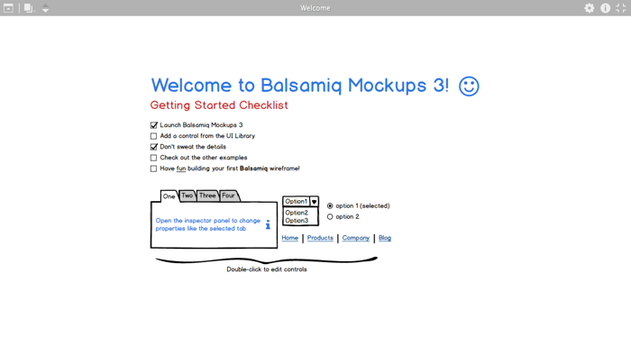
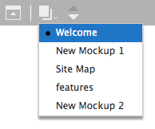
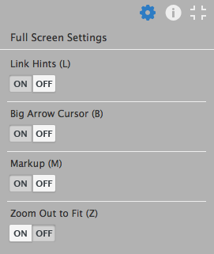

# 全屏演示模式

**最近已经上传完毕！** 
   
这篇网页是为了 [Balsamiq Mockups 3](https://balsamiq.com/products/mockups/) 而上传的。原来的文件您可以点击[这里](http://media.balsamiq.com/files/Balsamiq_Mockups_v1-v2_Docs.pdf)来观看。

Mockups 包含了全屏演示模式来展示你的线框给利益共享者或是用于可用性测试。

点击 Mockups 右上角的全屏显示图标，即可进入全屏演示模式，或者在视图菜单中选择“全屏演示”，或者直接使用快捷键 CTRL/CMD + F。

 

Mockups 将会扩大直到占据整个屏幕（为了消除干扰），并且你的 mockup 将会集中在屏幕上。

你可以使用左上方的图标来导航 mockups。最左边的图标可以控制顶部菜单的开关。你可以将顶部菜单关闭来移除 mockup 以外的任何东西（甚至图标也会消失，鼠标指针经过时才会出现），当你在做可用性测试时，这样非常有利于得到最真实的体验。

 

在默认情况下，你将会看到一个大的蓝色的箭头来代替常规的鼠标指针。这有利于演示你的 mockups。箭头将会指向屏幕的中间来让出更多的空间给你的 mockup。

你可以通过在全屏设置中关闭大蓝色箭头，点击右上角的齿轮图标可以打开设置面板。

 

设置面板同样有一个选项来控制打开和关闭链接提示。当链接提示打开时，包含的[链接](http://support.balsamiq.com/customer/portal/articles/111742)将显示为粉红色叠加，所以很容易被发现。

标记设置是为了显示或隐藏标记元素，像是便签、箭头和插图（UI 库中 [Markup](http://support.balsamiq.com/customer/portal/articles/110418) 标签下的任何控件）。如果你只想看你的 UI 而不看注释时，这将是非常有用的。

最后需要设置视图以缩小它来适应最大的 mockup。所有其他的 mockup 相对于最大的 mockup 都将被扩大。

这里的每一个设置都是有快捷键的，在面板中设置的名称后面会显示快捷键。在全屏模式中不需要修饰键。（如,要获得链接提示，仅需 L，而不是 CTRL/CMD + L）

紧接着设置图标的信息图表将会打开一个面板来查看并编辑选定 mockup 的记录，就像正常的编辑模式。

点击 ESC 键或点击右下角的图标将会退出全屏演示模式。
