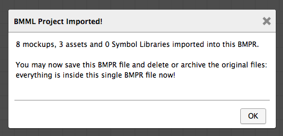

# 导入 Mockups 和符号

**最近已经上传完毕！** 
   
这篇网页是为了 [Balsamiq Mockups 3](https://balsamiq.com/products/mockups/) 而上传的。原来的文件您可以点击[这里](http://media.balsamiq.com/files/Balsamiq_Mockups_v1-v2_Docs.pdf)来观看。

## 从先前版本中（ BMML 文件）导入 mockups

Balsamiq Mockups 3 会从先前的版本中使用不同文件格式（[在这里可以了解更多](http://support.balsamiq.com/customer/portal/articles/1844131#projects)）。你可以用以下三种方式之一导入你的老版本 mockups：

1.单个BMML文件     

2.一个包含 assets 子文件夹中的图片 BMML 文件和符号的文件夹    
 
3.一个包含 assets 子文件夹中的图片 BMML 文件和符号的 ZIP 文件

可以通过打开Project > Import 菜单，将有的项目文件夹或是 ZIP 文件转换为 BMPR 文件。

选择你要导入内容后，你的老文件将会被导入，并且一个新的 BMPR 文件将会被创建。

你同样可以将 BMML 文件拖拽到 Balsamiq Mockups 3 来将他们导入到现在的项目中。

## 导入符号

如果你有先前版本的 Balsamiq Mockups 创建的符号文件，你能够使用 Import > BMML 符号库命令将他们作为符号导入 Balsamiq Mockups 3。

这将把分组转换为已命名的符号，并且会出现在 UI 库中的符号类里。这个命令非常有用，尤其适用于导入在 [Mockups To Go](http://support.balsamiq.com/customer/portal/articles/131430) 下载的符号。

## 从另一个项目中导入 mockups

你能够使用在项目菜单中的 Import/Export Mockup JSON 命令来快速从一个项目拷贝 mockups 到另一个项目。导出至 Mockups JSON (Project > Export > Mockup to JSON) 命令将拷贝选中的 mockup 的 Balsamiq Mockups 代码至剪贴板。要将这个 mockup 创建在一个新的项目中，就要切换至这个项目，并且在 Project > Import 菜单中选择 “Import Mockup JSON…”  并且粘贴复制好的代码。

## 导入图片

想要学习有关导入图片的知识，查看 [Working with Images](http://support.balsamiq.com/customer/portal/articles/110401)。
