# Balsamiq Mockups 3 简介

Balsamiq Mockups 3 是近一年创建我们客户一直需求的和我们想要为自己而创建的产品自上而下编程的结果。  

最显著的改变是两个人们自开始时就一直需求的“要点”：项目支持（打包文件，多窗口）和去除“浮动属性页面”（属性检视视图）。

但是后台完成的工作也是同样重要的，它更快而且更聪明并且改进我们所希望的将更好地使用它的经验。  

在这篇文章中你将找到有关[**哪儿去下载它**](http://support.balsamiq.com/customer/portal/articles/1844131#download)，[**最新情况**](http://support.balsamiq.com/customer/portal/articles/1844131#whats-new)，当然，还有[**怎样导入已存在的文件**](http://support.balsamiq.com/customer/portal/articles/1844131#importing)。如果你刚接触 Balsamiq Mockups 或者在读完这篇文章后想要钻研得更深，你可以看以下的[文档目录](http://support.balsamiq.com/customer/portal/articles/127377)和[应用程序概述](http://support.balsamiq.com/customer/portal/articles/109151)。  

这里是一个版本 3 的快速 5 分钟视频亮点介绍。 

[视频](https://youtu.be/-Zz8EYPhEew)

## 如何更新 

Balsamiq Mockups 3 现在是我们桌面产品的现行版本，可以在我们的[下载页](https://balsamiq.com/download/)上获得。它对于存在的用户来说是免费更新的，你甚至将不需要重新注册。  

Balsamiq Mockups 3 将和 Balsamiq Mockups 2（作为独立的应用程序）并行运行，所以不需要卸载你现在的版本来使用。看以下的[如何导入存在的文件](http://support.balsamiq.com/customer/portal/articles/1844131#importing)。  

当它已经被严格测试，如果你找到了任何 bug 或者问题，[告诉我们!](http://support.balsamiq.com/customer/portal/articles/1844131#feedback)你也能尝试下载一个新的构建，因为我们将快速响应 bug 报告并且一旦它们准备好就发放补丁。  

## Balsamiq Mockups 3 中有什么新的内容  

一句话概括，很多！这些是你应该知道的“亮点”：  

- [项目！](http://support.balsamiq.com/customer/portal/articles/1844131#projects)
- [自动保存](http://support.balsamiq.com/customer/portal/articles/1844131#autosave)
- [一个新的用户接口](http://support.balsamiq.com/customer/portal/articles/1844131#ui)
- [更简单的外观和感觉定制](http://support.balsamiq.com/customer/portal/articles/1844131#project-settings)
- [更好的标志](http://support.balsamiq.com/customer/portal/articles/1844131#symbols)
- [更好的图标](http://support.balsamiq.com/customer/portal/articles/1844131#icons)
- [更好的图像和资产](http://support.balsamiq.com/customer/portal/articles/1844131#assets)
- [全屏模式](http://support.balsamiq.com/customer/portal/articles/1844131#full-screen)
- [注释](http://support.balsamiq.com/customer/portal/articles/1844131#notes)
- [垃圾箱](http://support.balsamiq.com/customer/portal/articles/1844131#trash)
- [替换](http://support.balsamiq.com/customer/portal/articles/1844131#alternates)
- [音乐？](http://support.balsamiq.com/customer/portal/articles/1844131#music)

### 项目！  

最终，你不仅对于不同组别的实物模型有各自的窗口，而且所有属于项目的“东西”（实物模型，标志，图像，图标）在一个文件中。这使得它发送和移动文件，将所有东西放在一块要简单得多。  

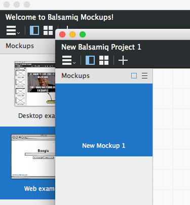

### 自动保存  

你的项目被自动保存了。不需要手动保存。当你重启实物模型时，所有东西在你停止的地方都将是对的。  

### 一个新的用户接口  

令人厌烦的到处飞的属性检视视图已经消失啦！现在你在左边拥有实物模型，右边拥有属相。简单，可预测并且快速。UI 库在它一直都在的顶部但是现在它有一点紧凑。  

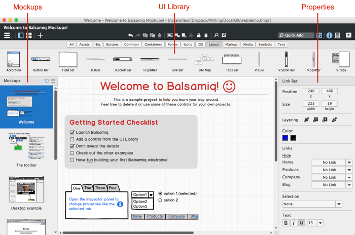

你可以通过点击 Quick Add 栏或者通过[键盘快捷键](http://support.balsamiq.com/customer/portal/articles/110445)来独立切换属性面板和 UI 库。

并且，当然，你可以使用每个面板的图标隐藏所有的面板，使你进入禅宗似的线框天堂。  

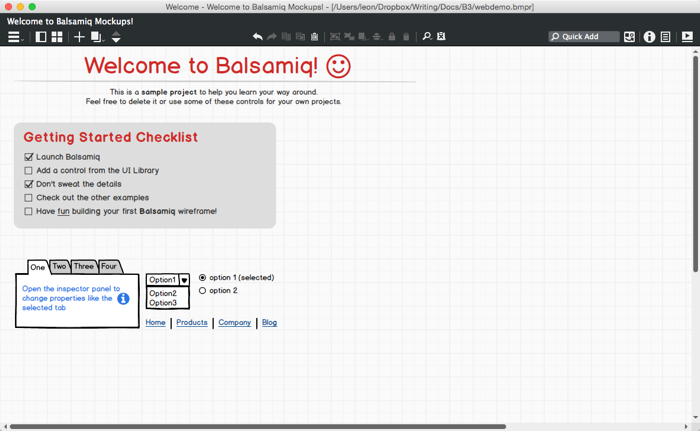 

使用 toolbar 中的图标四处浏览和进行普通的操作是简单的。  

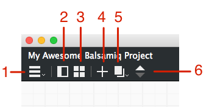

1.在 Mockup，资产，标志和垃圾箱中导航。  
2.展示/隐藏左边的面板  
3.用一个小网格显示你的实物模型  
4.创建一个新的实物模型  
5.Mockup 动作（重命名等）和在实物模型间（当左边面板被隐藏时展示）导航  
6.到下一个或前一个实物模型（当左边面板被隐藏时展示）

### 更简单的外观和感觉定制

在 Mockup 中所使用的字体的控制自从开始以来已经成为最需要的特点之一。之前自定义字体是可以使用一个复杂的配置文件来得到的，但我们现在允许你在新的[项目信息面板](http://support.balsamiq.com/customer/portal/articles/1895403)设置一个项目字体。是的，你现在可以简单地使用任何你已经在你的实体模型中安装的字体。庆祝！你也能为它设置一个默认的大小。

 

我们也把皮肤转换选项移动到了新的项目信息面板中，来使得它们更加明显（许多人从来不知道我们的[线框皮肤](http://support.balsamiq.com/customer/portal/articles/98988)）。最后，默认的选择颜色在新的面板中也是可配置的。

### 更好的标志 

在之前的版本中国我们把标志称为一个“先进的特征”。但是，不再这么说了。标志现在是对于所有人来说的。标志允许你创建模板，作品，和其他可重复使用的成分来节省时间和保证一致性。它们对于大项目和自定义控件来说尤其是有用的，而是是我们 [Mockups To Go 页面](http://mockupstogo.mybalsamiq.com/) 的核心。  

你现在可以跳跃到标志面板并从草稿中创建一个新的，它将出现在 UI 库的“标志”标签。你仍然可以通过老方法创建它们（创建一个有名字的组合并点击 “Convert To Symbol” 按钮）。

 

我们现在也在它们的标志库中将标志以列表展示，所以你可以在它们之间更简单地导航并且知道你正在编辑哪个标志。

 

最后，我们更简单地导入标志。就像点击 “Import Symbol Library” 图标选择文件导入。

 

### 更好的图标

在这里有大改动。

首先，现在图标在 UI 库中有它们自己的种类所以你能拖放它们就像其他控件一样。

 

不仅如此，它们在 Quick Add 结果中显示，当通过名字或键盘搜索时节省了你的时间。

 

图标搜索结果在任何匹配你进入文章的 UI 控件下显示。

你将很快注意到我们比起前一个版本有一个完全不同的图标集。我们把我们的图标转换到非常受欢迎的 [Font Awesome](http://fortawesome.github.io/Font-Awesome/) 图标集。这意味着现在有超过 500 个预先安装的图标。

### 更好的图像和资产

现在有一个图像和其他导入的东西的专门区域，从导航栏可以进入。

 

你可以将图像添加到你的项目中而不需要首先将它们放到你的实体模型中。点击 “Import Asset...”按钮来从你的电脑添加文件或者 “Download Asset...”图标来从 Flickr 或者网页中添加一个图像。或者只是从你的电脑中拖动一张图像到画布。

 

你也可以从面板中的上下文菜单删除，重命名，克隆和下载图像。  

### 新的全屏模式

同一个选项仍在在那儿但是我们已经改革了经验来使得它具有更好的可用性测试和展示。我们也去除了实体模型在全屏模式下跳出的问题。

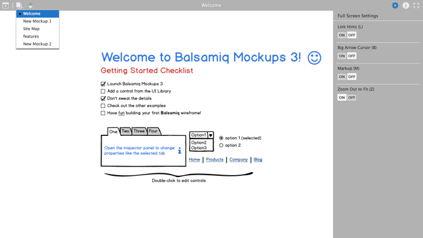 

### 注释

当没有控件被选择时你将在属性面板中看到一个地方来添加注释。你可以为你的项目，Mockups，资产，标志库和单独的标志添加注释，它们将被保存为项目的一部分。

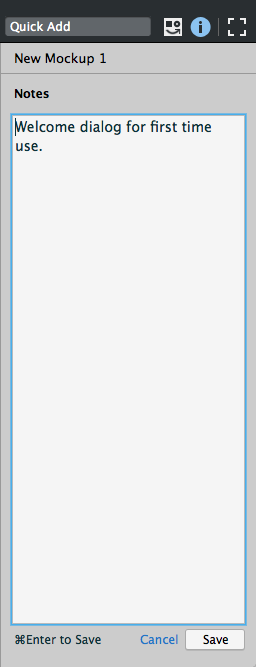

### 垃圾箱

Balsamiq Mockups 3 现在对于你已经删除的实体模型，资产和标志有一个垃圾箱。这使得当你在进行项目时保持你的项目整洁变得简单，但是仍然不允许你浏览和恢复之前的概念。

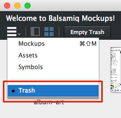

为了从垃圾箱面板恢复一个对象，点击上下文菜单箭头并且选 “Restore”。你也可以选择永久删除。

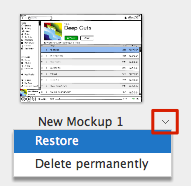

### 替换

替换（有时候也指版本或分支）允许你在一个单独的实体模型设计上创建变更而不通过添加更多的实体模型到你的项目中。[在这里读全文件](http://support.balsamiq.com/customer/portal/articles/1956540)。

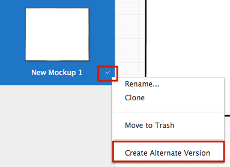

### 音乐？？？

是的，内置的背景音乐帮助你进入你的创新领域！[检查博客看更多的细节](http://blogs.balsamiq.com/product/2015/04/29/3-1/)

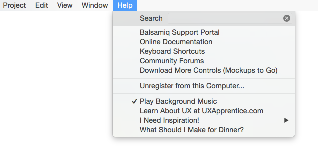

### 什么不是新的

我们留下经验的大部分添加，安排和编辑控件是相同的，所以如果你是从前一个版本来的话应该是很熟悉的。

我们希望所有这些改变是受欢迎的并且 Balsamiq Mockups 3 仍然像是你一直了解和喜爱的应用程序，但是它更好了！如果你有任何想法或反馈，[请让我们知道!](http://support.balsamiq.com/customer/portal/articles/1844131#feedback)

## 导入存在的文件

Balsamiq Mockups 3 有一个新的文件格式来为[项目](http://support.balsamiq.com/customer/portal/articles/1844131#projects)提供支持但是你能简单地导入你的旧文件。

为了将你存在的文件夹或 ZIP 文件转换成 BMPR 文件，只要去往 Project > Import 菜单。

选择你所喜欢的来导入而且你的旧文件将被导入然后一个新的 BMPR 文件将被创建。

## 欢迎反馈

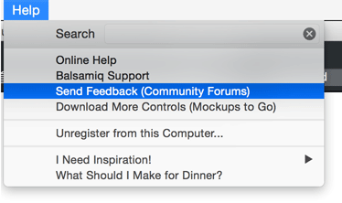

这对于我们来说是一个巨大的改变所以我们十分乐意地想要知道您是如何考虑的。如果你找到任何问题或者有任何评论，请使用 Mockups 中的 Help > Send Feedback 菜单来在新的 [Balsamiq Forums](http://forums.balsamiq.com/) 中评论。我们将在那看到你！
