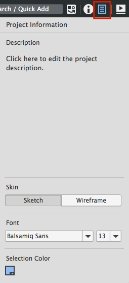

# 项目信息面板

**最近已经上传完毕！** 
   
这篇网页是为了 [Balsamiq Mockups 3](https://balsamiq.com/products/mockups/) 而上传的。原来的文件您可以点击[这里](http://media.balsamiq.com/files/Balsamiq_Mockups_v1-v2_Docs.pdf)来观看。

在 Balsamiq Mockups 3 中的新特性是可以为皮肤、字体和被选中的颜色定义一个覆盖整个工程的设置。项目信息面板包含上述这些设置，并且可以在这里为项目添加注释。单击位于属性检视视图图标旁边的图标来触发项目信息面板（快捷键：CTRL/CMD + , )。  

  

这些设置将应用到工程中的全部 Mockups 中并且将随工程保存(也就是即使工程被关闭并重新打开或者分享给他人这些设置依然存在)。  
若想要了解更多有关素描和线框图的区别，可以参见[使用皮肤](http://support.balsamiq.com/customer/portal/articles/938142)。  

默认字体是 [Balsamiq Sans](https://balsamiq.com/products/mockups/font/) ,与之前的版本一样(并不像你想像的那样是 Comic Sans；尽管现在你可以设置成这个字体，但是你们这些喜欢 Comic Sans 的人请离开！)   

>注释：如果你想使用其他的我们介绍的工程字体，你可以在你创建 Mockups 之前设置它。修改工程字体可能会对工程中已有 Mockups 有不利影响。每种字体有不同的规模和比例，所以切换字体可能会导致重叠或者线条不均匀的情况发生。也许你的工程设置了多种字体比如 "thin","light" 或者 "extrabold" 可能会复写个体控制中的字体格式设置。`
