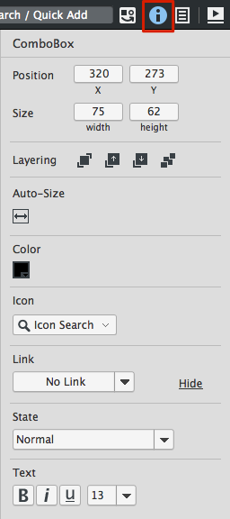
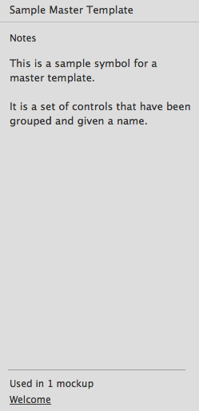

# 属性检视视图

**最新更新！**  
这个页面已经被更新为[Balsamiq Mockups 3](https://balsamiq.com/products/mockups/)。旧文档在[这里](http://media.balsamiq.com/files/Balsamiq_Mockups_v1-v2_Docs.pdf)。

属性检视视图是一个应用程序右边的面板，它允许你设置一些普通的属性,比如排列，位置和大小以及对特定控件的指定设置（选择状态，文本属性，颜色等等）。这在当查看实物模型，资产和标志时是可获得的。

你可以通过点击上面的切换图标显示并隐藏属性检视视图（键盘快捷键 CTRL/CMD +；或 ALT/Option + Enter）。当隐藏时你也可以通过右击一个控件和选择 “Properties...”展示它。

如果你有多个选择的控件，这会显示所有选择控件和排列以及分布选项通用的属性。

## 添加注释到你的实物模型，标志和资产

当没有控件被选择时，属性检视视图为选择的实物模型，资产或者标志显示注释。在 Mockups 视图中面板也显示了 [mockup alternates](http://support.balsamiq.com/customer/portal/articles/1956540)。

**注意：**你可以使用[这里描述的语法](http://support.balsamiq.com/customer/portal/articles/110121#basicformatting)来规定注释文本的格式，如使文本加粗，加下划线等。

对于资产和标志，它也展示了对象被使用的计数和实物模型的名字。
