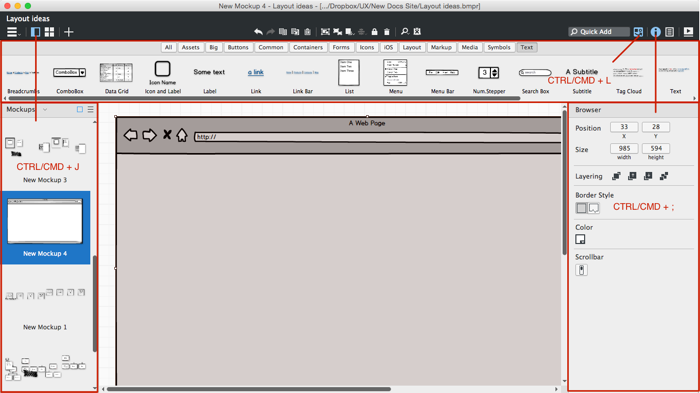
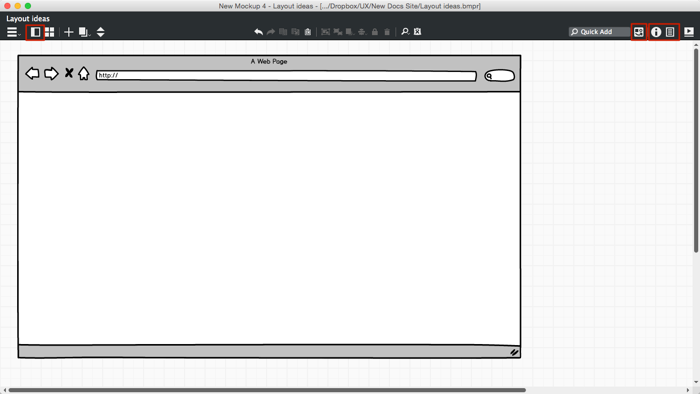

# 我的屏幕较小，如何能够看到更大的画布?

**最近已经上传完毕！** 
   
这篇网页是为了 [Balsamiq Mockups 3](https://balsamiq.com/products/mockups/) 而上传的。原来的文件您可以点击[这里](http://media.balsamiq.com/files/Balsamiq_Mockups_v1-v2_Docs.pdf)来观看。

正如在 [Mockups Application Overview](http://support.balsamiq.com/customer/portal/articles/109151) 中描述的那样，用户界面分为五个部分。基本工作区域是 [Canvas](http://support.balsamiq.com/customer/portal/articles/109151#canvas) 而且它总是在屏幕中央可见的。不管怎样，可能你不需要或者不想随时看到其它区域。  

源于这个原因，[UI Library](http://support.balsamiq.com/customer/portal/articles/109151#uilibrary), [Navigator](http://support.balsamiq.com/customer/portal/articles/109151#filebrowser), 和 [Properties panels](http://support.balsamiq.com/customer/portal/articles/109151#propertiespanel) 均可以使用鼠标或者键盘**自由选择开关**。  

下图中这些可以控制这些面板自由开关的图标已被高亮显示。

控制开关的快捷键列表:  

- UI Library: <kbd>CTRL</kbd> + <kbd>L</kbd> 或 <kbd>CTRL</kbd> + <kbd>F1</kbd>
- Navigator: <kbd>CTRL</kbd> + <kbd>J</kbd>
- Properties Panel: <kbd>CTRL</kbd> + <kbd>;</kbd> 或者 <kbd>ALT</kbd> + <kbd>ENTER</kbd>
- Project Info Panel: <kbd>CTRL</kbd> + <kbd>,</kbd>

隐藏所有面板之后用户界面是这样的:

当面板没有被显示的时候，关联的工具栏图标从蓝色变成了白色。  

值得注意的时当 UI Library 被隐藏时你还可以使用 [Quick Add](http://support.balsamiq.com/customer/portal/articles/109151#quickadd) 来在画布上添加控件。还有当 Navigator Panel 隐藏时，你可以使用 [additional toolbar icons](http://support.balsamiq.com/customer/portal/articles/109151#appbar) 来在你的 mockup 之间切换。