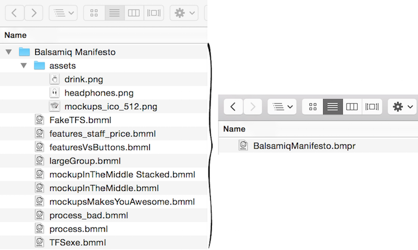
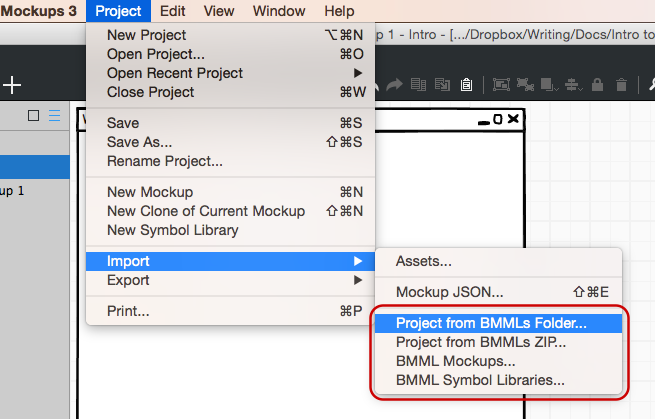

# 版本过渡指南

感谢尝试我们的最新的 Balsamiq Mockups 版本！我们认为你将真正喜欢上所有的提升并且觉得它使用起来非常简单。为了学到更多的有关新的特征你可以读一读 [Balsamiq Mockups 3 简介](http://support.balsamiq.com/customer/portal/articles/1844131)或者钻研我们的[完全文档](http://support.balsamiq.com/customer/portal/articles/127377)。

这篇文章想要回答一些你可能会有的从前一个版本转换到当前的 Balsamiq Mockups 3 的问题。

## 这是一次免费更新吗？

是的！并且它和旧版本使用相同的许可，所以你甚至将不必重新注册。Mockups 3 也有免费的小版本更新，所以你将能得到 3.1,3.2,3.3 等。

## 我的 BMMLs 无法打开，出了什么事？

如果你正在从 Balsamiq Mockups 的版本 2 过渡到版本 3，最重要的事就是知道 Balsamiq Mockups 3 使用了一个新的文件格式。我们通过这次改版大大简化了将你的实体模型组织到项目中的过程并且使得它更简单地分享文件。  

在之前的版本每个实物模型是一个单独的文件而且图片和标志需要被存储到一个特定的子文件夹中以被识别。这使得它在和许多实物模型，许多图片和多个工程一起工作时令人感到疑惑。

现在不再如此。我们新的文件格式，BMPR（或者，“bumper”），包含了在一个单独文件中的工程内的所有的实物模型，包括它的图片和标志。所有东西都放在同一处，即使你移动了文件。你的实物模型现在表现得更像 PowerPoint 中的幻灯片或者主题文档。

对于我们现存的用户来说，这意味着你将需要导入你存在的文件到 Balsamiq Mockups 3 以让它们工作。不要担心，我们使得它非常简单。

有许多选项来导入，从带入整个项目到导入单独的实物模型或者标志库。只要点击 Project > Import 菜单，就像下面展示的。

看[这一页](http://support.balsamiq.com/customer/portal/articles/1895737#importingbmml)得到更多的详细说明。

我们有两个建议如果你想要转换到  Balsamiq Mockups 3 但是在 BMML 格式下有运行的工程：

1.**并行使用 版本 2.2 和 3。**应用程序名字是不同的所以你可以一起运行两个版本。为了连续性你也许想要完成所有版本 2 的工程并在版本 3 中开始新的工程。

2.**完全转换到版本 3。**导入所有的你的运行中的工程到新的 Balsamiq Mockups 3 工程并且完全停止使用版本 2。来来回回将是一种痛苦因为你将频繁地导入导出。

导入的实物模型应该看起来和它们在前一个版本中一样，除了我们旧的图标已经被 [Font Awesome icons](http://support.balsamiq.com/customer/portal/articles/110202) 代替（你会更喜欢）。

## 你其它的产品 - myBalsamiq 和插件呢？

我们新的文件格式和用户接口将马上应用于所有我们的产品。同时，你可以[导入](http://support.balsamiq.com/customer/portal/articles/1895737)和[导出](http://support.balsamiq.com/customer/portal/articles/111730#exportbmml) ZIP 文件或者单独的 BMMLs，但是你可能只想等到 BMPR 应用于你的其它 Balsamiq 产品。所有东西将马上无缝衔接 - 感谢你的耐心。

## 我如何在 Balsamiq Mockups 3 从 Mockups To Go 中使用标志？

在 Import 菜单有一个选项可以导入标志库。[点击这里获得更多细节](http://support.balsamiq.com/customer/portal/articles/1895737#importingsymbols)。

## 旧图标在哪里？我仍然可以使用它们吗？

我们将它们放置在 [Font Awesome](http://support.balsamiq.com/customer/portal/articles/110202) 图标集，那儿有更多的图标并且是更通用的。

怀念旧的？你可以在这里下载它们：

- [Balsamiq Mockups version 2 icon set - Sketch skin](http://media.balsamiq.com/files/balsamiq_2_icons_sketch.zip)（.zip 文件，268Kb）
- [Balsamiq Mockups version 2 icon set - Wireframe skin](http://media.balsamiq.com/files/balsamiq_2_icons_wireframe.zip) （.zip 文件，234Kb）

看[作为自定义图标添加它们的说明](http://support.balsamiq.com/customer/portal/articles/110202#packs)。

