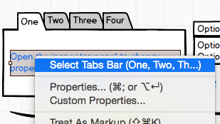
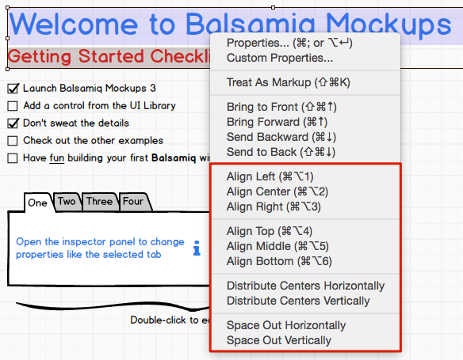
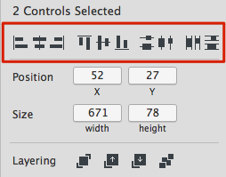
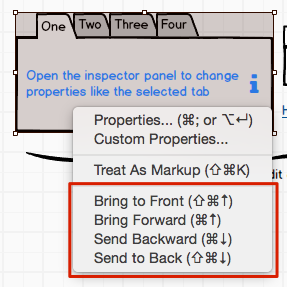

# 使用 UI 视图

**最新更新！**  
这个页面已经被更新为[Balsamiq Mockups 3](https://balsamiq.com/products/mockups/)。旧文档在[这里](http://media.balsamiq.com/files/Balsamiq_Mockups_v1-v2_Docs.pdf)。

## 添加 UI 控件

为了添加 UI 控件到你的实物模型，双击或者拖动一个控件到 [UI 库](http://support.balsamiq.com/customer/portal/articles/109151#uilibrary)或者输入一个关键词到[快速添加工具](http://support.balsamiq.com/customer/portal/articles/109151#quickadd)。

你也可以使用复制和粘贴命令（CTRL/CMD + D）来复制已经在画布上的控件。ALT/Option + 拖动也将复制控件并允许你使用鼠标放置它们。

**注意：**[键盘快捷键](http://support.balsamiq.com/customer/portal/articles/110445)的全列表在这儿。

## 选择 UI 控件

有一些不同的方法来选择 UI 控件。如果你熟悉图形软件，这些应该是不会让人太过惊讶的。

- 点击 UI 控件选择它
- 拖动一个包含了许多 UI 控件的矩形选择它
- SHIFT + 点击一个控件将它添加到选择中
- CTRL/CMD + 点击一个选择的控件将它从选择中除去
- 按住 ALT 来忽略鼠标后的项目并拖动选择，就如在[短视频](http://www.youtube.com/watch?v=JOpaRBbwqNg)所显示的

为了选择在另一个控件后的控件，右击顶端的控件来打开一个允许你选择它后边控件的菜单。

## 移动 UI 控件

一旦你已经选择了一个或多个 UI 控件，有一些不同的方法来移动它到画布。

- 你可以同你的鼠标拖动（按下 SHIFT 按键来保持原始的水平或垂直位置）
- 你可以用你键盘的 UP/DOWN/LEFT/RIGHT 键一次“微调”一个像素
- 你可以通过按下 SHIFT 和使用你键盘的 UP/DOWN/LEFT/RIGHT 键用更大的幅度移动它（10 像素）
- 你可以使用[以下所示的排列工具](http://support.balsamiq.com/customer/portal/articles/110078#aligninguicontrols)移动控件到排列成一个方向。

## 拍摄和智能指南

当你移动画布上的对象时，Mockups 尽量建议一个在画布上能使用智能指南和与其他对象相关的排列。这使得排列稍许简单一些而且使得你的 Mockups 看起来更简洁。

如果你想要暂时禁用这个特性，你可以当移动或者调整时按住 CTRL/CMD 键，这样拍摄将被关闭。

## 调整 UI 控件

调整所选择的控件是简单的。你可以仅仅抓取任何所选择矩形的边或角然后拖动它。

如果你想要在仅从一个角上拖动时限制属性，在拖动时按下 SHIFT 键。

你也可以使用键盘来调整选择的控件。CTRL/CMD + ALT + 方向键来以 1 像素的增幅调整，CTRL/CMD + ALT + SHIFT + 方向键来以 10 像素的增幅调整。

调整一些控件到它们的“实际尺寸”的另一种方法是使用在[属性检视视图](http://support.balsamiq.com/customer/portal/articles/110114)中可以找到的 Auto-Size 功能。

## 排列 UI 控件

你可以通过选择多个控件和右击打开下面显示的菜单来排列和分布（间距隔开）控件。

同一个选项当多个控件被选择时显示在属性检视视图中。

## 将 UI 控件分层

你可以将控件分层，就好像它们是实物模型画布上的几页纸。为了这么做，你选择你想要分层的控件并通过右击菜单或者[属性检视视图](http://support.balsamiq.com/customer/portal/articles/110114)选择可获得的四个分层命令中的一个：置为顶层，上移一层，置为底层，下移一层。[键盘快捷键](http://support.balsamiq.com/customer/portal/articles/110445)也是可行的。

## 删除 UI 控件

为了从实物模型画布上移除一些 UI 控件，选择它们并点击 DELETE 键。或者你可以点击工具栏中的垃圾箱图标或从编辑菜单选择 “Delete”。

## 将 UI 控件分组

有时候你可能想要将一些控件分组来更好地排列它们或者立刻移动它们。为了将一个集合的控件分组，选择它们并在你的键盘上点击 CTRL + G 或者在工具栏编辑菜单中使用 Group 命令。一旦被分组，控件在移动或排列时将表现为只有一个控件在移动或排列。为了解除控件分组，在你的键盘上按下 CTRL + SHIFT + G 或者使用菜单或工具栏中的 Ungroup 命令。组可以被嵌套。

你可以双击一个组来“进入”并且编辑它的内容。这里有一个视频来解释如何使用这个特征：

[视频](https://youtu.be/OgX27oUrkLY)

你可以有选择地通过属性检查器给予一个组名字。这在当你有许多组和当你编辑它们的内容时需要“知道你在哪儿”时会变得很有用。在创建[标志](http://support.balsamiq.com/customer/portal/articles/110439)时命名组也是很有用的。

## 剪裁组

剪裁（遮蔽）组仅仅显示它们中所选择的一部分是有可能的。

下面的视频展示了如何使用这个强大的功能：

[视频]()
