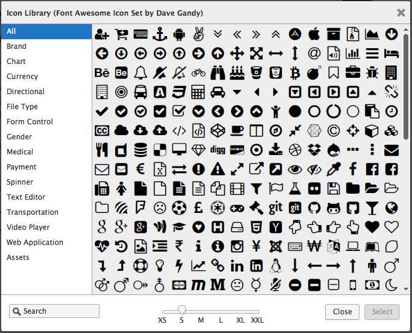
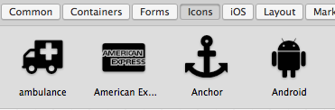
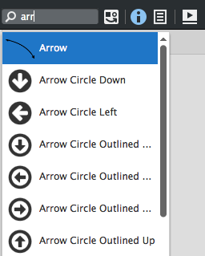
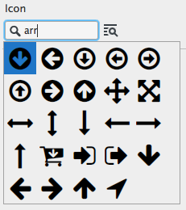
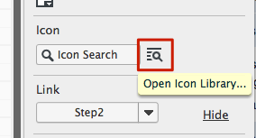
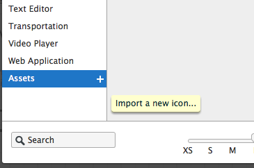
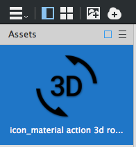
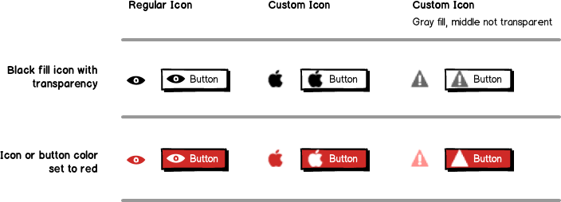

# 使用图标

**最近已经上传完毕！** 
   
这篇网页是为了 [Balsamiq Mockups 3](https://balsamiq.com/products/mockups/) 而上传的。原来的文件您可以点击[这里](http://media.balsamiq.com/files/Balsamiq_Mockups_v1-v2_Docs.pdf)来观看。

Balsamiq Mockups 3 包含令人难以置信的 [Font Awesome](http://fortawesome.github.io/Font-Awesome/) 的图标集。包含了超过 500 个图标，而且种类丰富，从极小到很大的图标都有。而且它还频繁地更新，我们计划无论何时我们发布的新版本都要保持同步更新（[了解更多我们为何转换](http://blogs.balsamiq.com/product/2015/03/31/font-awesome/)）。 

这里几乎有所有你想要的图标，但是如果没有，你可以[添加自己的图标](http://support.balsamiq.com/customer/portal/articles/110202-working-with-icons#custom)或者[从 Front Awesome 要求一些新的图标](http://fortawesome.github.io/Font-Awesome/community/#requesting-new-icons)。  

  

之前版本 Balsamiq Mockups 中的图标已经重新绘制成新图标。了解在 Balsamiq Mockups 3 项目中[如何使用旧图标](http://support.balsamiq.com/customer/portal/articles/1908765#oldicons)。  

## 通过 UI 库或 Quick Add 来添加图标

在 Balsamiq 3 同样是新内容，图标现在在 UI 库中有它们自己的类别了，所以你可以像其它控件一样拖拽它们。  

  

不只是这些，它们会在 Quick Add 结果中显示，节省你用名字或关键字来搜索的时间。  

图标检索到的与你输入匹配的结果将显示在任何 UI 控件的下方。  

## 通过属性检视视图添加和替换图标  

一些控件允许你为它们添加图标(比如按钮)。你可以在[属性检视视图](http://support.balsamiq.com/customer/portal/articles/110114)完成，两种方法任选其一：搜索图标和图标库对话框。  

### 搜索图标

如果你选中的控件支持图标，你可以在属性面板看到搜索图标框。这看起来很像 [Quick Add 工具](http://support.balsamiq.com/customer/portal/articles/109151#quickadd)，只需要输入你寻找的图标名字中的几个字母，就会列出许多供选择的图标。只要在你想用的上面单击就可以了。  

然后你可以调整图标大小从 "X5"(16 px)到 "XXL"(128 px)。你也可以通过搜索框旁边的按钮旋转图标 90 度。  

### 图标库对话框

如果你想浏览所有可用图标，点击图标搜索框右边的图标。

这样就会显示图标库对话框，在这里你可以分类浏览并预览不同大小的图标。你可以双击一个图标来立即选择或者单击选中在点击 "Select" 按钮添加它。  

在你选中了一个图标之后，你可以通过属性检视视图重新调整它的大小，旋转它或者移除它。  

## 添加你自己的定制图标

你也可以在你的线框图中添加自己的图标。  

### 通过图标库对话框添加

有两种方式向 Balsamiq Mockups 中添加定制图标。一种是通过图标库对话框。  

在底部选择 Assets 分类，然后点击小加号按钮，选择一个图标文件然后你的图片将被调整至符合已有图标大小并添加至你的资源中。

### 通过 Assets 添加

第二种方式是手动添加图标文件到你的[资源](http://support.balsamiq.com/customer/portal/articles/110401)中。如果你为每一个文件名添加 "icon_" 前缀，并将它们拖拽到你的资源中，它们将出现在图标库和 Quick Add 搜索中。  

>注释：MAC 用户可以为多个文件快速添加 "icon_" 前缀通过使用[批重命名工具 Mac OS X](https://support.apple.com/kb/PH19067?viewlocale=en_US&locale=en_US)（10.10 或更高版本）。

在图标对话框中，文件名 "icon\_" 后面的内容将作为检索的关键字。所以文件名为 icon\_airplane.png 的关键字为 "airplane"。你可以将几个标签组合在一起来获得标签的近义词。例如，如果文件被命名为 icon\_bag briefcase portfolio.png ，那么所有这些在 icon_ 之后的词都将可搜索。  

## 使用已经存在的定制图标集

有一些图标集用来补足手绘风的 Mockups。这个[在 Tips Blogger 的博客](http://www.tipsblogger.com/2009/11/30-awesome-hand-drawnsketch-icon-sets/)列举了一些更手绘风的图标集，可能会有用。  

有些图标设计者已经开始创建图标包，兼容我们的命名体制。这里有[一些我们知道的](http://support.balsamiq.com/customer/portal/articles/135659#icons)。  

如果想使用这些图标包，只需要解压图标文件，并把它们拖拽到你的 Assets，像[之前描述的那样](http://support.balsamiq.com/customer/portal/articles/110202-working-with-icons#assets)。如果你正在使用 myBalsamiq，可以通过 Assets 对话框上传图标文件。  

## 创建或准备定制图标的最佳练习

Mockups 使用颜色和透明度，但是如果你添加的图标没有做 Mockups 希望它们做的准备的话，恐怕不会像你想像中的那样显示。下面给出一些建议让你的定制图标更好用。

**颜色**

- Mockups 使用黑色来代替 100% 不透明度。
- 图标不创建成黑色的会在上色时会有不良影响。
- 我们建议使用黑色作为你的图标的颜色。

**透明区域**

- Mockups 为图标整个不透明区域着色。
- 为了最佳效果，我们建议将你的图标的白色区域设置为透明。透明的 PNG 文件最佳。

下列例子在左列显示常规图标，在中间列是使用黑色的定制图标，然后最右列是一些看起来不太好的图标。修理最右侧图标的方式是将感叹号变成透明，然后颜色选择黑色。  

