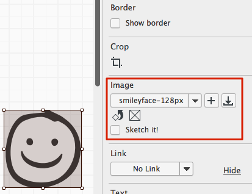
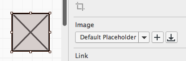
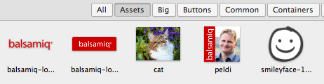
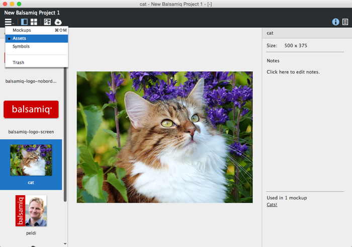
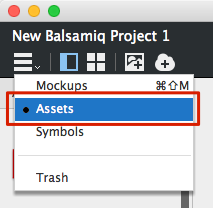
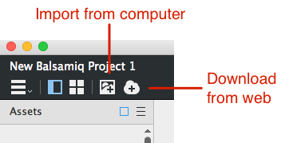
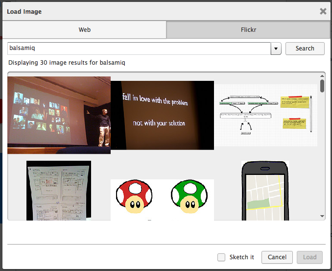
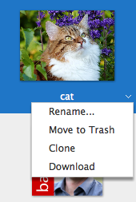

# 使用图像

**最近已经上传完毕！** 
   
这篇网页是为了 [Balsamiq Mockups 3](https://balsamiq.com/products/mockups/) 而上传的。原来的文件您可以点击[这里](http://media.balsamiq.com/files/Balsamiq_Mockups_v1-v2_Docs.pdf)来观看。

有多种方式可以向你的 Mockups 中添加图像。最简单的方法只需要拖拽一个图片文件从你的电脑到你的 Mockups 画布上。来阅读一些更多在你的工程中添加并使用图像的方法吧。  

## 在 Mockups 视图中添加图像

正如上面提到的，从你的电脑上拖拽一个图像到 Balsamiq Mockups 会把它添加到你的画布上。这样做会将图片放在你选中的 Mockups 中并拷贝图像文件到你的 [Assets](http://support.balsamiq.com/customer/portal/articles/110401-working-with-images#assetsview) 目录中，所以你可以很轻松的在其他 Mockups 上重复使用它。  

你可以在属性检视视图中修改图片属性，和其他 UI 控制一样。  

图像的特定属性如下：  

- **下拉菜单**显示你当前图片的名字。打开它会允许你选择一个其他的你已经上传到 [Assets](http://support.balsamiq.com/customer/portal/articles/110401-working-with-images#assetsview) 目录中的图像。
- 在下拉菜单旁边的**"+" 图标**允许你从你的电脑里添加一个图像。这与你拖拽一个图片进来效果相同。
- 单击**下载图标**打开一个对话框可以通过输入 URL 来从网络上直接或者从网络相册上搜索并添加图像。Mockups 支持 GIF, JPG/JPEG, 和 PNG 图像格式。文件将从网上下载并复制到你的工程中。
- 单击下拉菜单下面的**旋转图标**每次让你的图像旋转 90 度。
- 单击**方框中有一个 "x" 的图标**将会还原你的图像成为一个默认的占位符图像。
- **素描！复选框**将转换你的图像成为一个仅使用黑白线条描绘的版本。

如果你还没有准备好一个图像文件或者你想使用一个占位符图像来保证你的 Mockup 低保真度，你可以从 [UI 库](http://support.balsamiq.com/customer/portal/articles/109151#uilibrary)中添加一个图像控制，然后它就会显示一个方框里面有一个 "x"。你可以稍后再使用上面提到的图像属性来用一张图像代替它。  

只要图像添加到你的项目中，它将在 UI 库中显示，然后你就可以轻松的将它应用在你项目中的任何 mockup 中。"Assets" 分类下将显示所有你添加到项目中的图像。  

这也意味着你可以从 [Quick Add](http://support.balsamiq.com/customer/portal/articles/109151#quickadd) 中给你的 Mockups 添加图片。只需要输入图像名的前几个字母它就会出现在列表之中。  

>注释：你可以通过在 UI 库中在图像上单击右键并选择 "Move Image to Trash" 或者从[Assets 视图的上下文菜单](http://support.balsamiq.com/customer/portal/articles/110401-working-with-images#managing)中删除图像。

图片属性面板还允许你修剪或掩盖图片使得只显示它们的一部分。你可以在这里[看一个修剪图像的指导](http://support.balsamiq.com/customer/portal/articles/1430586)。已经修剪过的图像会在属性面板上显示移除修剪的图标。  

除了图像控件，你也可以在 Cover Flow 控制中嵌入图像。  

## 在 Assets 视图中添加图像

Balsamiq Mockups 3 有一个专用的用户接口区域来管理图像，称为 Assets 视图。  

assets 视图显示所有已经添加到项目中的图像和[常用图标](http://support.balsamiq.com/customer/portal/articles/110202#custom)。你可以选择 assets 中的导航视图来看到它。  

你可以通过从你的电脑里拖拽的方式或者使用工具栏的图标来在 Assets 视图中添加图像。  

  

"Import Asset..."图标允许你从你的电脑里选择一个或多个图像，同时可以在 Mockups 视图里使用 "Download Asset..."得到相同的对话框输入 URL 从网络相册上获得图像。  

只要你添加了图像，就可以以缩略图或者是列表的形式查看它们，在[缩略图视图](http://support.balsamiq.com/customer/portal/articles/109151#thumbnailgrid)也一样。  

右侧的[属性面板](http://support.balsamiq.com/customer/portal/articles/109151#propertiespanel)显示了选中图像边框的像素，并且允许你在上面添加注释。面板的下面显示了这个图片被应用在了哪些 Mockups 中（如果有的话）。举个例子，这一般常常用来管理图像，你可以删除一些没有被使用的图像。点击一个 mockup 的名字将跳转至它的 Mockups 视图。  

## 图像管理

像在 Mockups 视图中那样，在 Assets 视图中有一个[上下文菜单](http://support.balsamiq.com/customer/portal/articles/109151#contextmenu),你可以在导航栏或者下拉菜单中右键单击来打开。这样你可以重命名、克隆、丢弃或者下载你的图像。  

  

### 重命名图像

在上下文菜单中使用重命名图像会改变你的项目中资源的名字。这不会影响到你的本地文件，因为图像是添加到项目中的一个副本。重命名图像会在你的 Mockups 中更新，所以并不需要手动的更新它们。  

### 删除图像

你同样可以使用上下文菜单来从项目中删除图像。正如你的 Mockups,删除将会把图像移至[回收站](http://support.balsamiq.com/customer/portal/articles/1844131#trash)，从那里你可以永久地删除或者是还原它们。值得注意的是从 Mockups 画布上删除它们并不意味着从工程中删除它们。  

### 将图像从工程保存到本地

你可以在上下文菜单中使用 "Download" 选项来将图像从工程保存到本地，这样你可以从工程中提取出图像来做其他事情。
