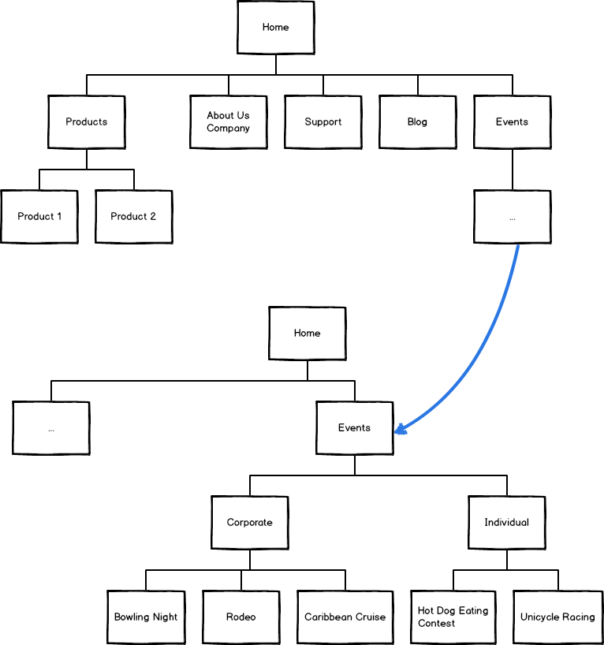

# 使用站点地图

**最近已经上传完毕！** 
   
这篇网页是为了 [Balsamiq Mockups 3](https://balsamiq.com/products/mockups/) 而上传的。原来的文件您可以点击[这里](http://media.balsamiq.com/files/Balsamiq_Mockups_v1-v2_Docs.pdf)来观看。

你可以通过使用站点地图控件来创建简单的站点地图。

## 创建站点地图

从 UI 库添加一个 "Site Map" 控件到画布上。

通过双击或选中来编辑控件并且点击回车。

首先编辑一个概念图来创建亲子关系。每一行在你的站点地图中代表一个盒子（页面或结点）。使用连字符在父母下缩进子结点。这是一个示例：

```
Home 
- Products 
  -- Product 1 
  -- Product 2 
- About Us\rCompany 
- Support 
- Blog
```

这是上面所说的概念图：


## 注意事项和选项

- 只支持单一树：站点地图的第一行代表全局的双亲，而且只存在一个全局双亲，因为站点地图只支持一棵树的存在。如果你想要创建多棵树，请添加多个地图控件。
- 多行文本：在结点中你可以通过使用 \r 来进行换行操作。如：关于 \r 我们
- 你不可以重新设置站点地图的大小，但是如果你不能在你的画布中显示整个地图，你可以将其中一个结点在整个站点地图中进行放大。


